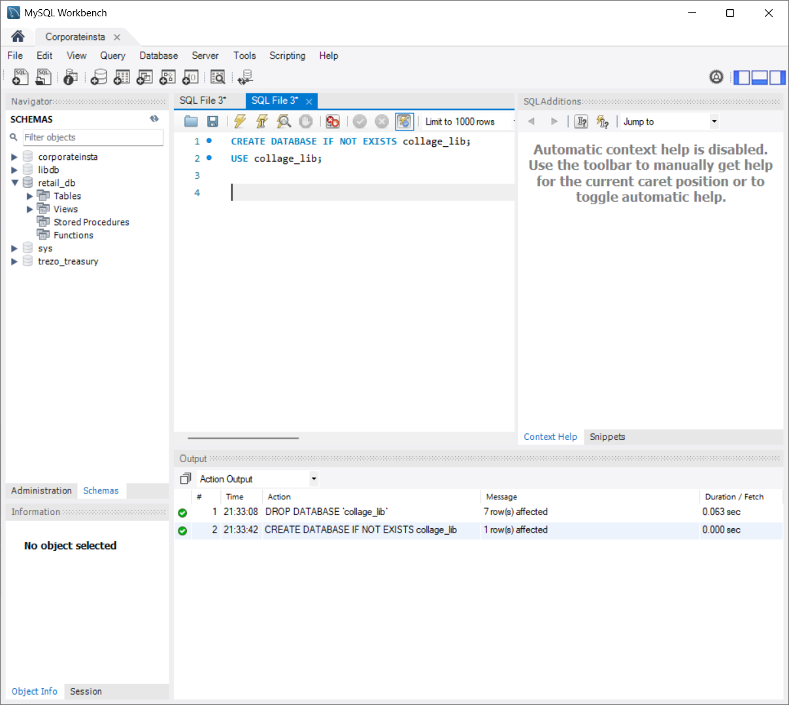
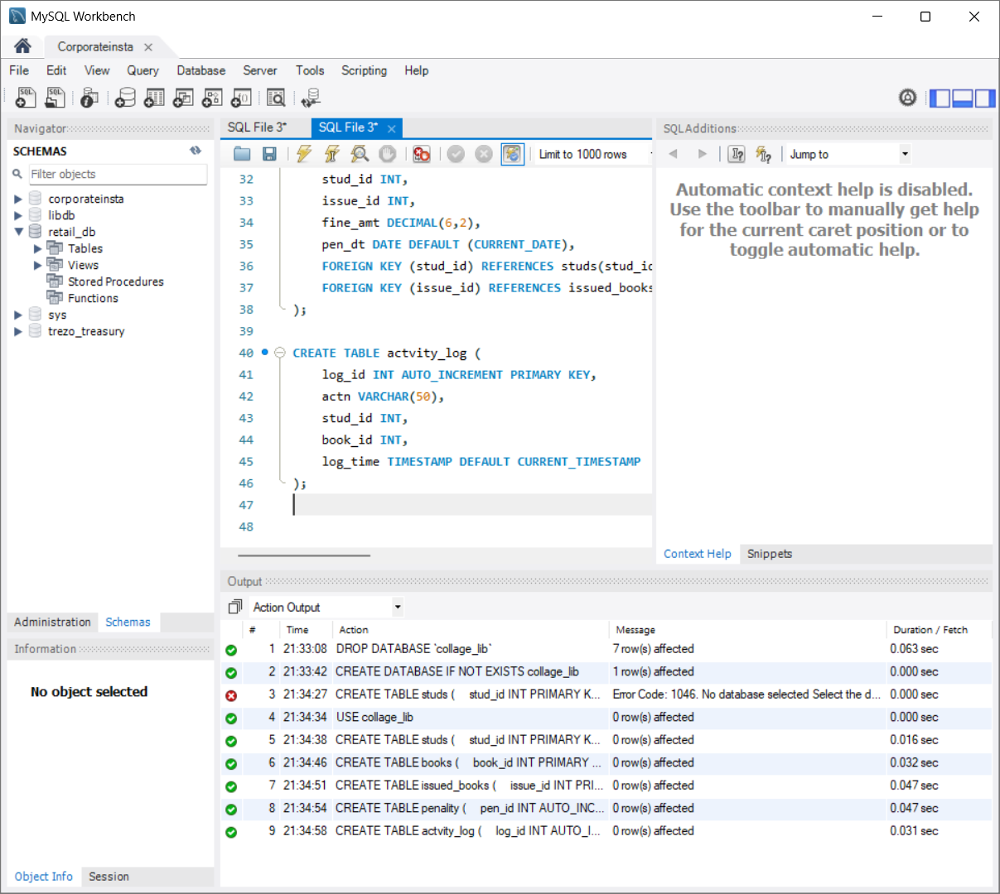
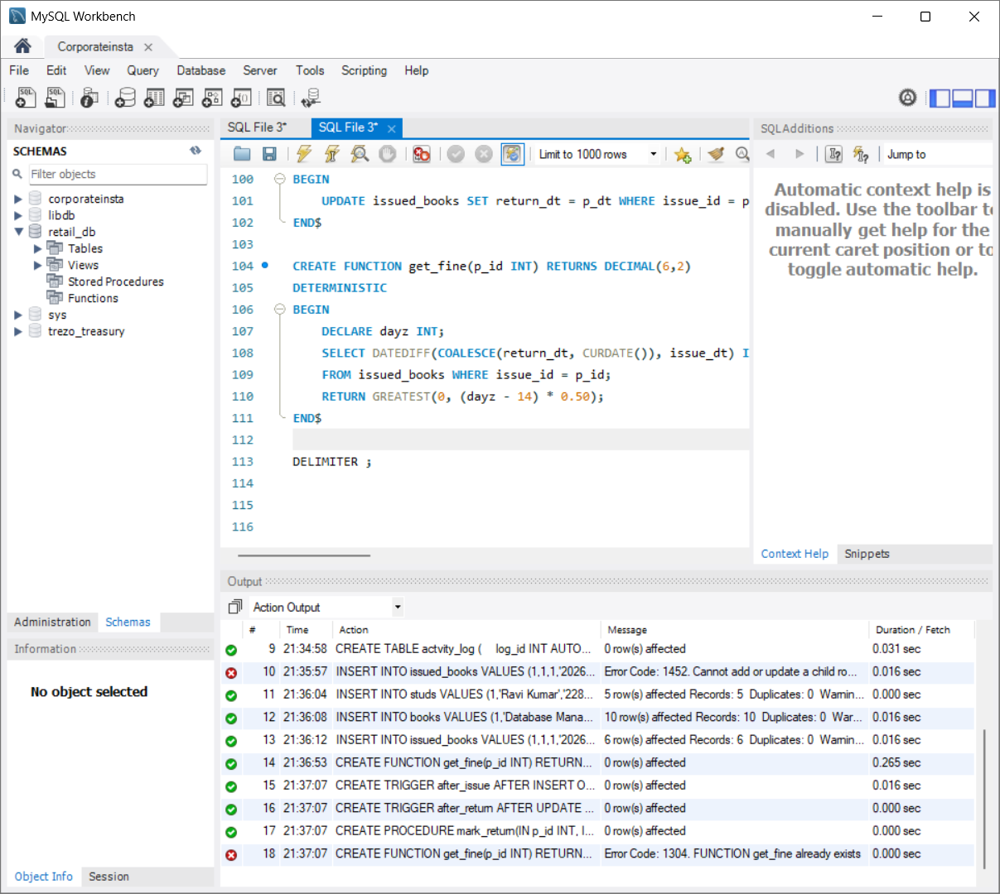
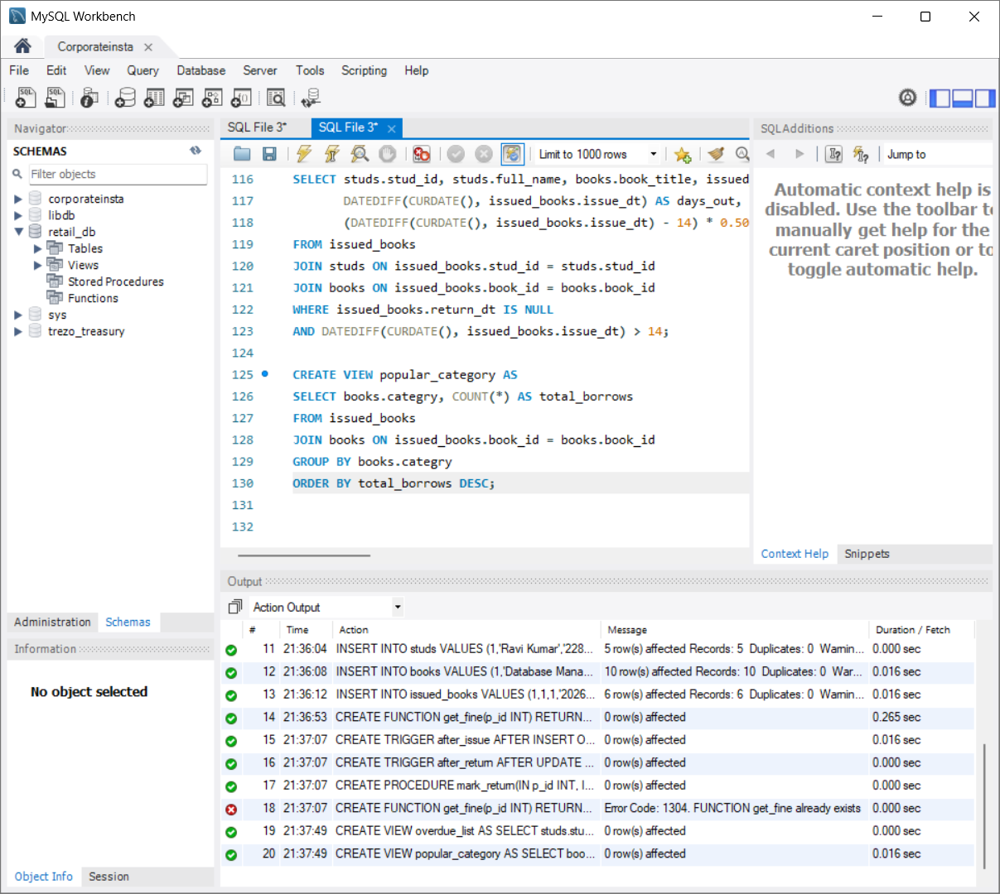
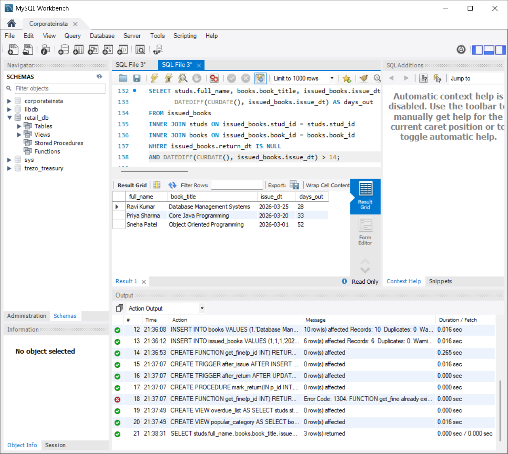
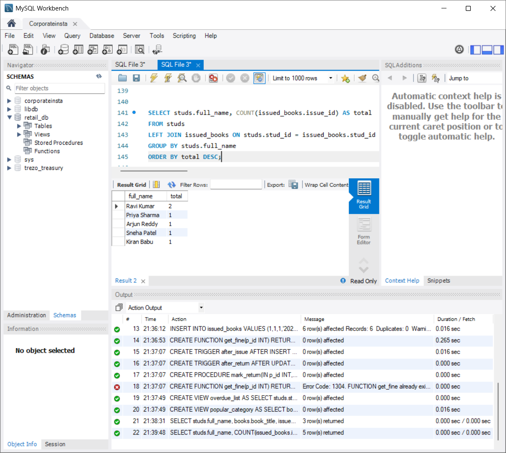
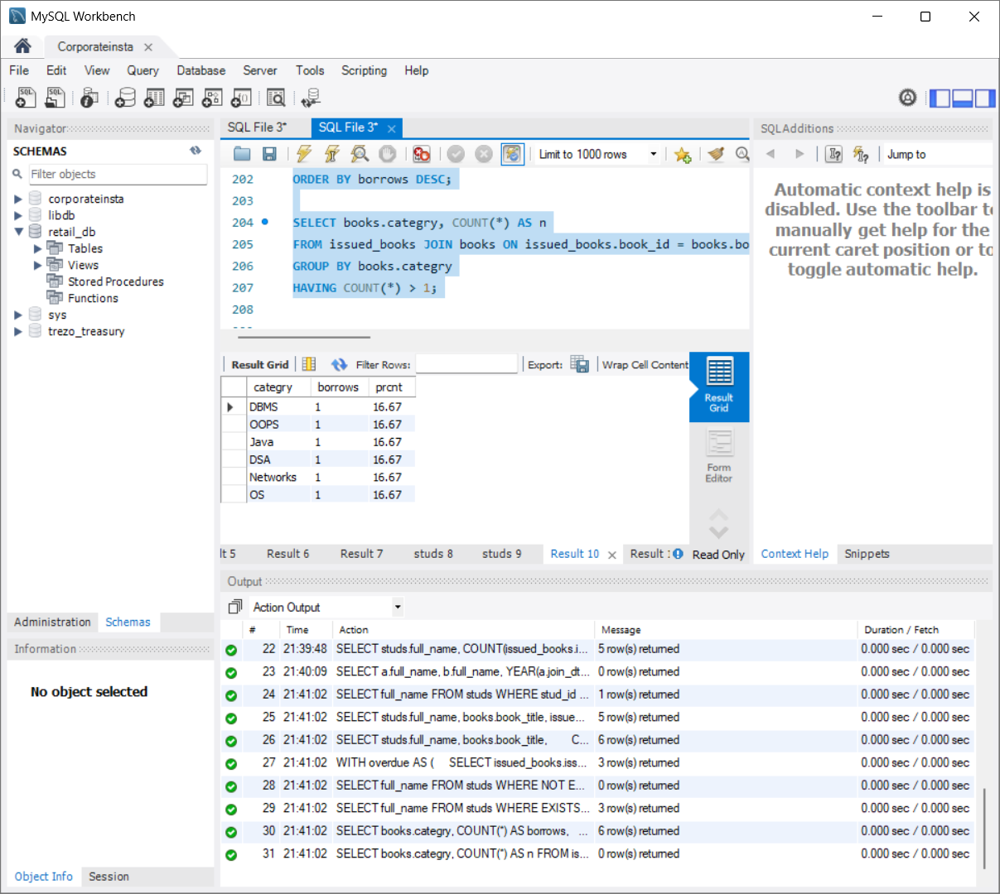
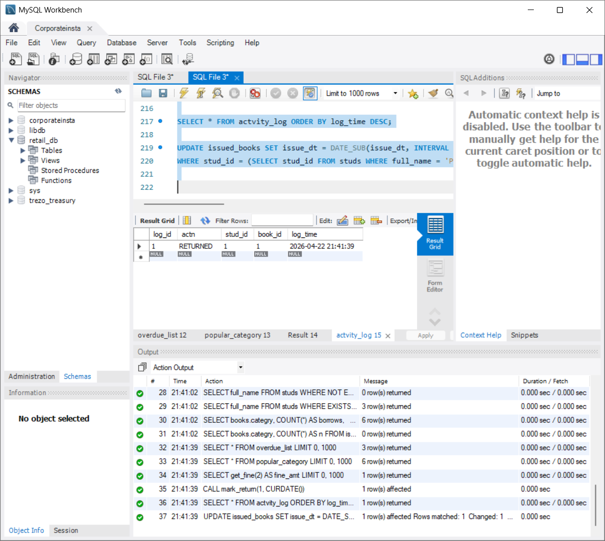
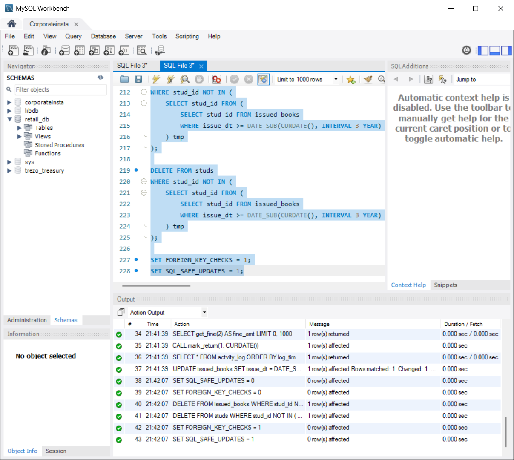

# Digital Library Audit – SQL Project

A relational database system for a community college library to track book loans, overdue returns, penalties, and borrowing trends.

## Tables

| Table | Purpose                           |
| ----- | --------------------------------- |
| `s`   | Students                          |
| `b`   | Books with stock count            |
| `ib`  | Issued books (loans)              |
| `pen` | Penalty records                   |
| `log` | Audit log of issue/return actions |

## Features Covered

- DDL: table creation, indexes, views
- DML: insert, update, delete
- Joins: INNER, LEFT, RIGHT, FULL OUTER, SELF
- Subqueries, correlated subqueries, CTEs
- Window functions: RANK, running COUNT
- Aggregates with HAVING, CASE expressions
- UNION, INTERSECT, EXCEPT
- Triggers: auto stock update, auto penalty insert, audit logging
- Stored procedure: `pr_return` to mark a book returned
- Scalar function: `fn_fine` to calculate fine for a loan

## Requirements

- PostgreSQL 13+

## Execution

**Run the full file:**

```bash
psql -U <username> -d <database> -f library.sql
```

**Create a fresh database and run:**

```bash
createdb libdb
psql -U postgres -d libdb -f library.sql
```

**Run interactively:**

```bash
psql -U postgres -d libdb
\i library.sql
```

**Check overdue books:**

```sql
SELECT * FROM v_overdue;
```

**Check popular categories:**

```sql
SELECT * FROM v_pop;
```

**Return a book (loan id, return date):**

```sql
CALL pr_return(1, CURRENT_DATE);
```

**Get fine for a loan:**

```sql
SELECT fn_fine(2);
```

**View audit log:**

```sql
SELECT * FROM log ORDER BY ts DESC;
```

## Screenshots

### 1. Create Tables

DDL — database and all five tables (`studs`, `books`, `issued_books`, `penality`, `actvity_log`) created.



### 2. Insert Data

DML — sample rows inserted into `studs`, `books`, and `issued_books`.



### 3. Triggers, Stored Procedure & Function

`after_issue` and `after_return` triggers, `mark_return` procedure, and `get_fine` function defined.



### 4. Views

`overdue_list` and `popular_category` views created.



### 5. Joins

INNER, LEFT, RIGHT, and SELF join queries executed against students and books.



### 6. Subqueries & CTE

Correlated subqueries, `EXISTS`/`NOT EXISTS`, and a CTE for overdue fine calculation.



### 7. Overdue & Popular Category Views

`SELECT * FROM overdue_list` and `SELECT * FROM popular_category` results.



### 8. Procedure, Function & Audit Log

`mark_return` called, `get_fine` result, and `actvity_log` output.



### 9. Update & Delete

Conditional UPDATE on issue date and DELETE of inactive records with safe-update guards.


