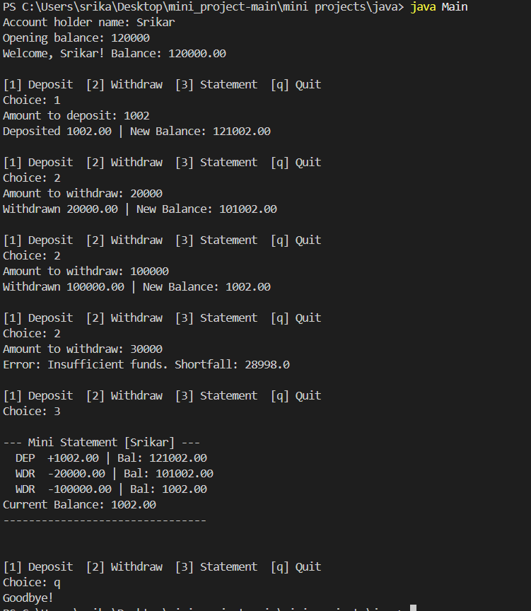

# FinSafe – Transaction Validator

A console-based Java application for a digital wallet that validates transactions, prevents overdrafts, and logs activity.

## Files

| File                              | Purpose                                          |
| --------------------------------- | ------------------------------------------------ |
| `Main.java`                       | Entry point, menu loop                           |
| `Account.java`                    | Encapsulated account with deposit/withdraw logic |
| `InSufficientFundsException.java` | Custom exception for overdraft                   |

## Java Topics Covered

- Encapsulation with private fields and getters
- Custom exception class extending `Exception`
- `throw` / `try-catch` error handling
- `IllegalArgumentException` for invalid input
- `ArrayList` for transaction history (capped at 5)
- `Scanner` for user input
- `String.format` / `printf` for output formatting
- Switch-case menu loop

## Requirements

- Java 8+

## Compile & Run

```bash
javac *.java
java Main
```

## Menu Options

```
[1] Deposit    – add funds to account
[2] Withdraw   – deduct funds (throws error if insufficient)
[3] Statement  – view last 5 transactions and current balance
[q] Quit
```

## Screenshots



## Sample Session

```
Account holder name: Srikar
Opening balance: 120000
Welcome, Srikar! Balance: 120000.00

[1] Deposit  [2] Withdraw  [3] Statement  [q] Quit
Choice: 1
Amount to deposit: 1002
Deposited 1002.00 | New Balance: 121002.00

[1] Deposit  [2] Withdraw  [3] Statement  [q] Quit
Choice: 2
Amount to withdraw: 20000
Withdrawn 20000.00 | New Balance: 101002.00

[1] Deposit  [2] Withdraw  [3] Statement  [q] Quit
Choice: 2
Amount to withdraw: 100000
Withdrawn 100000.00 | New Balance: 1002.00

[1] Deposit  [2] Withdraw  [3] Statement  [q] Quit
Choice: 2
Amount to withdraw: 30000
Error: Insufficient funds. Shortfall: 28998.0

[1] Deposit  [2] Withdraw  [3] Statement  [q] Quit
Choice: 3

--- Mini Statement [Srikar] ---
  DEP  +1002.00 | Bal: 121002.00
  WDR  -20000.00 | Bal: 101002.00
  WDR  -100000.00 | Bal: 1002.00
Current Balance: 1002.00
--------------------------------

[1] Deposit  [2] Withdraw  [3] Statement  [q] Quit
Choice: q
Goodbye!
```
