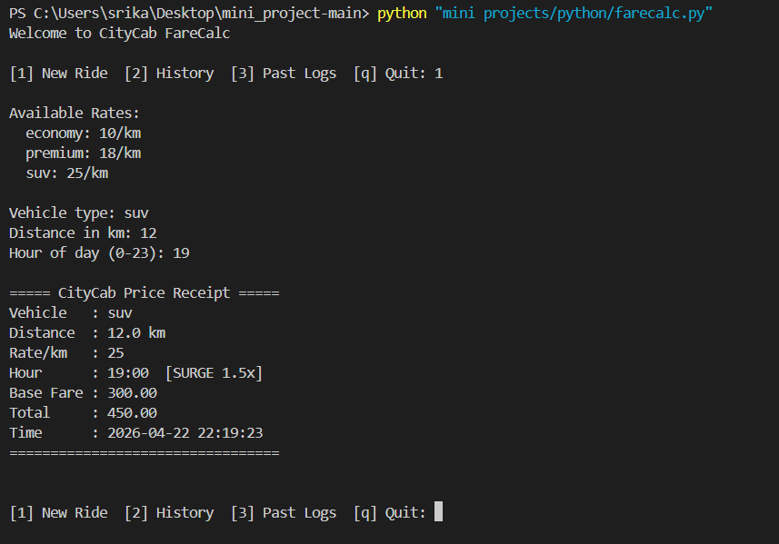
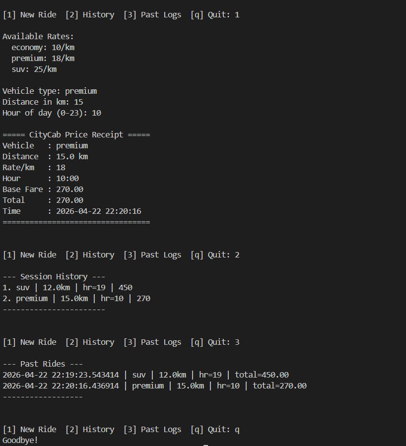

# FareCalc – CityCab Travel Optimizer

A Python backend script that calculates ride fares based on distance, vehicle type, and surge pricing.

## Files

| File          | Purpose                         |
| ------------- | ------------------------------- |
| `farecalc.py` | Main script                     |
| `rides.log`   | Auto-generated ride history log |

## Vehicle Rates

| Type    | Rate/km |
| ------- | ------- |
| Economy | 10      |
| Premium | 18      |
| SUV     | 25      |

Surge multiplier of **1.5x** applies between 17:00 – 20:00.

## Python Topics Covered

- Dictionaries and loops
- Functions and custom exceptions (`FareError`, `InputError`, `VehicleError`)
- `try / except / raise` error handling
- File I/O with `open()`, `FileNotFoundError`, `PermissionError`
- `datetime` for timestamps
- `math.ceil` for fare rounding
- `isinstance` for type validation
- In-memory session history (list)
- Menu-driven loop with `KeyboardInterrupt` and `EOFError` handling

## Requirements

- Python 3.6+
- No external libraries needed

## Run

```bash
python farecalc.py
```

## Menu Options

```
[1] New Ride   – enter vehicle, distance, hour and get a receipt
[2] History    – view rides from current session
[3] Past Logs  – view last 5 rides from rides.log
[q] Quit
```

## Screenshots

### Fare Receipt with Surge Pricing

SUV ride for 12 km during peak hours (19:00) — surge multiplier of 1.5x applied.



### Receipt, Session History, Past Logs & Quit

Premium ride for 15 km at off-peak hours, followed by viewing session history, past ride logs, and exiting.



## Sample Receipt

```
===== CityCab Price Receipt =====
Vehicle   : Premium
Distance  : 12.0 km
Rate/km   : 18
Hour      : 18:00  [SURGE 1.5x]
Base Fare : 216.00
Total     : 324
Time      : 2026-04-14 18:30:00
=================================
```
