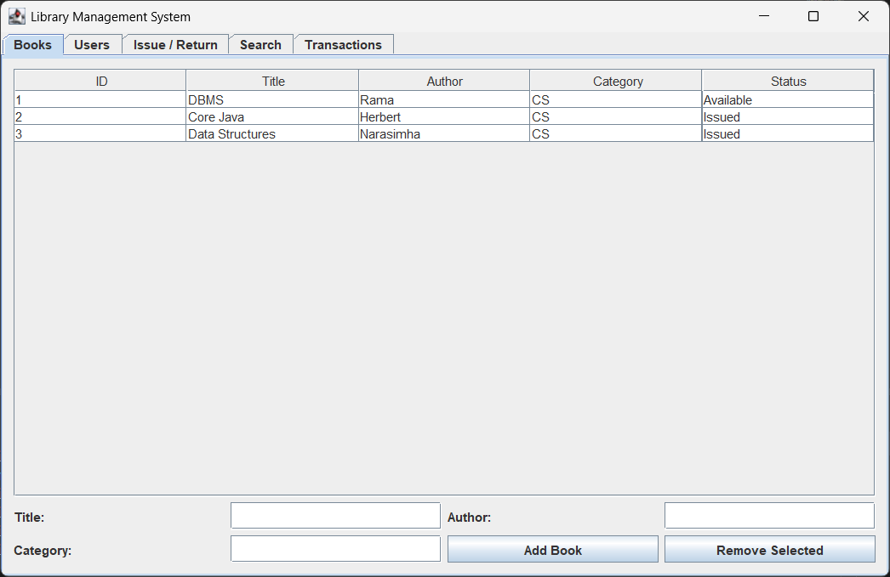
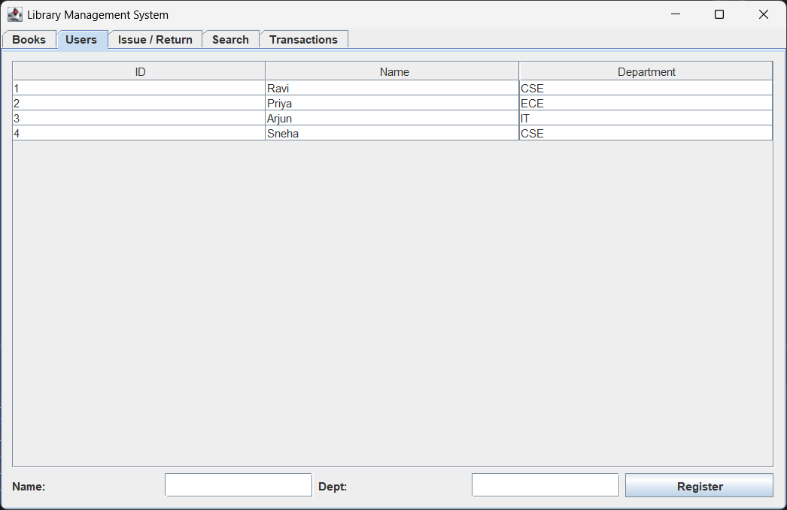
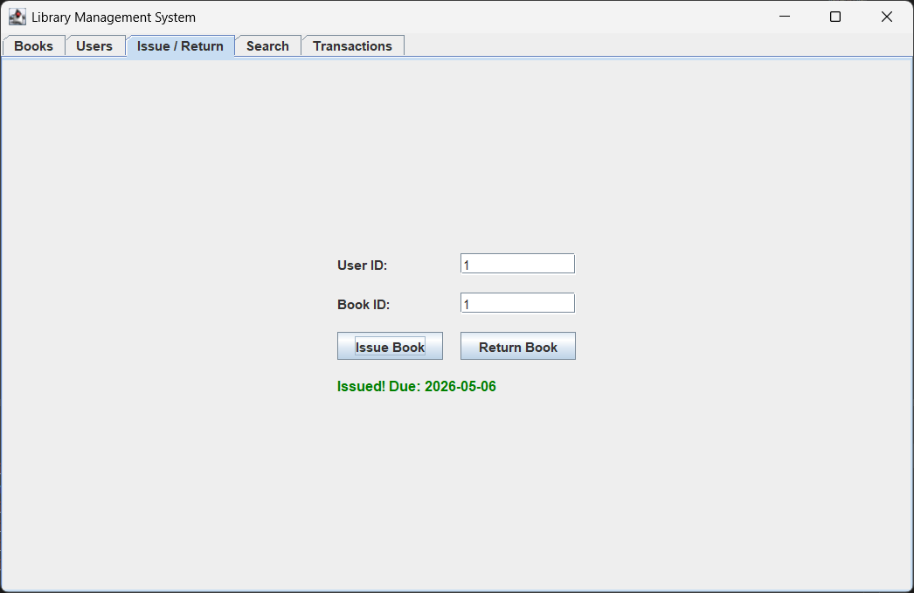
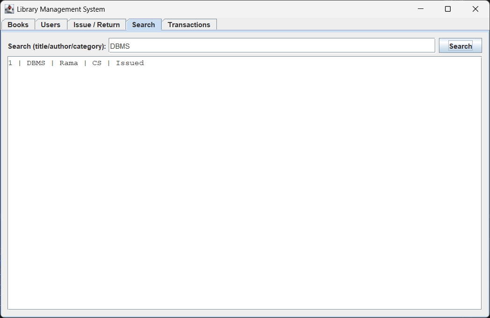
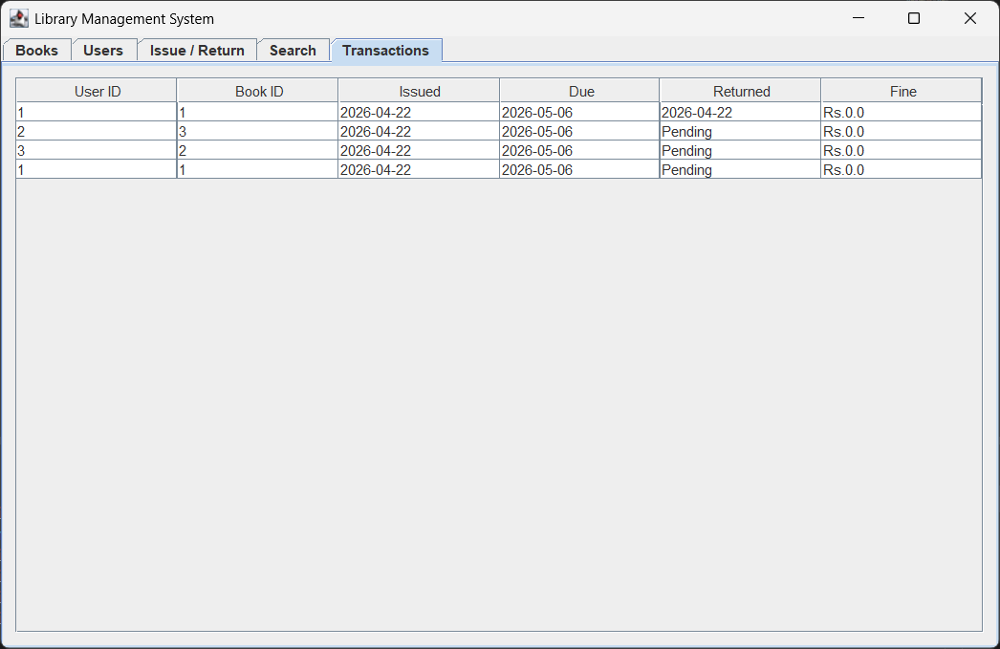

# Library Management System

A Java Swing GUI application to manage books, users, and library transactions.

## Files

| File               | Purpose                     |
| ------------------ | --------------------------- |
| `LibraryApp.java`  | Main GUI with all 5 tabs    |
| `Book.java`        | Book model                  |
| `User.java`        | User model                  |
| `Transaction.java` | Issue/return and fine logic |

## Run

```bash
javac *.java
java LibraryApp
```

## Features

- Add and remove books
- Register users with department
- Issue and return books with due date
- Fine calculation for late returns (Rs.2 per day)
- Search books by title, author, or category
- Transaction history log

## Screenshots

**Books Tab**


**Users Tab**


**Issue / Return Tab**


**Search Tab**


**Transactions Tab**

