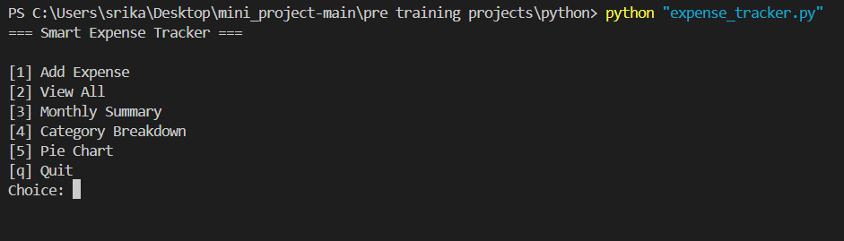
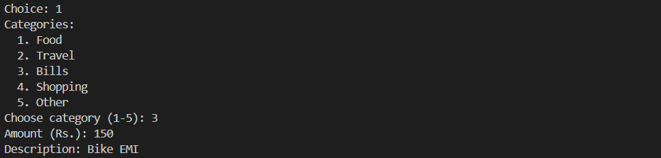
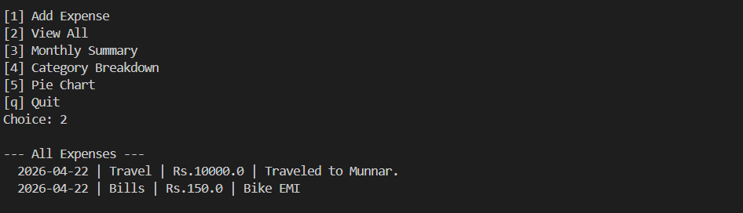
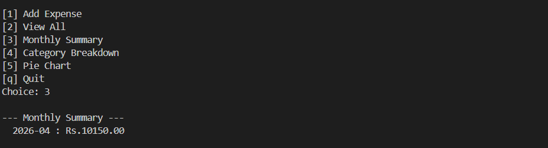
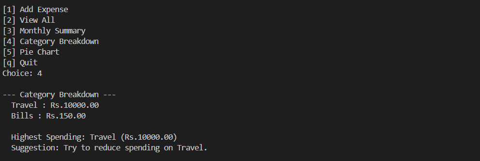
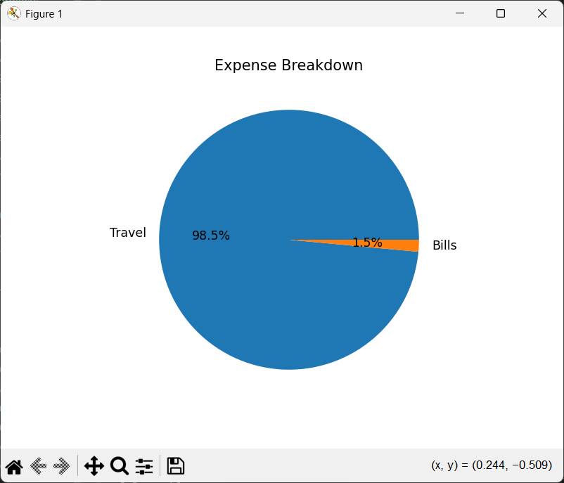

# Smart Expense Tracker

A Python CLI application to log, categorize, and analyze daily expenses.

## Files

| File                 | Purpose                  |
| -------------------- | ------------------------ |
| `expense_tracker.py` | Main script              |
| `expenses.csv`       | Auto-generated data file |

## Run

```bash
python expense_tracker.py
```

## Features

- Add expenses with category, amount, and description
- View all recorded expenses
- Monthly summary with total spending
- Category-wise breakdown with highest spending detection
- Pie chart visualization using matplotlib
- Data stored in CSV file

## Menu Options

```
[1] Add Expense
[2] View All
[3] Monthly Summary
[4] Category Breakdown
[5] Pie Chart
[q] Quit
```

## Install matplotlib

```bash
pip install matplotlib
```

## Screenshots

**Main Menu**


**Add Expense**


**View All**


**Monthly Summary**


**Category Breakdown**


**Pie Chart**


**Quit**

