# Retail Store Database

A MySQL project that models a retail store with customers, products, orders, and order items. Includes table creation, data insertion, views, and analytical queries.

## Files

| File         | Purpose                                       |
| ------------ | --------------------------------------------- |
| `retail.sql` | Full SQL script: schema, data, views, queries |

## Run

```sql
source retail.sql;
```

Or open `retail.sql` in MySQL Workbench and execute all statements.

## Schema

```
customers (customer_id, name, city)
products  (product_id, name, category, price)
orders    (order_id, customer_id, date)
order_items (order_id, product_id, quantity)
```

## Features

- Normalized schema with foreign key constraints
- Sample data: 6 customers, 8 products, 8 orders, 11 order items
- Three analytical views: top products, customer spending, monthly revenue
- Queries for sales analysis, customer insights, and inactive customer detection

## Views

| View                | Description                            |
| ------------------- | -------------------------------------- |
| `top_products`      | Products ranked by total quantity sold |
| `customer_spending` | Total spend per customer with city     |
| `monthly_revenue`   | Revenue grouped by month               |

## Queries

| Query                    | Description                              |
| ------------------------ | ---------------------------------------- |
| Top products by quantity | Products ordered by total units sold     |
| Customer spending        | Total amount spent per customer          |
| Monthly revenue          | Revenue breakdown by month               |
| Category sales           | Total sales grouped by product category  |
| Customers with no orders | Customers who have never placed an order |
| SELECT \* FROM views     | Query all three analytical views         |

## Screenshots

**Create Database**
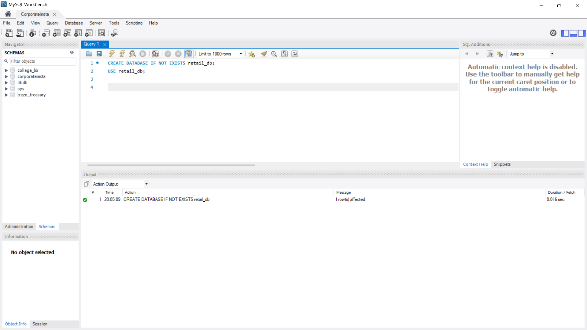

**Create Table: Customers**
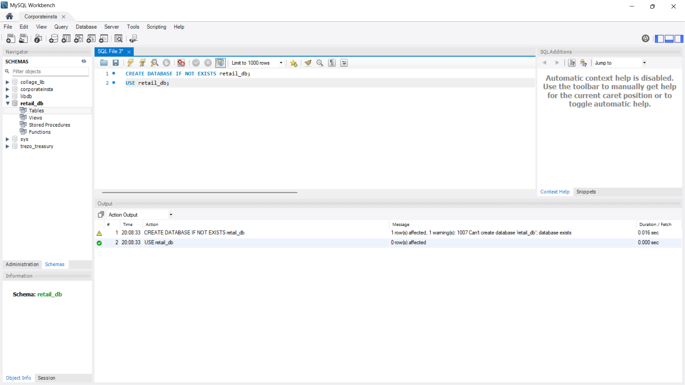

**Create Remaining Tables**
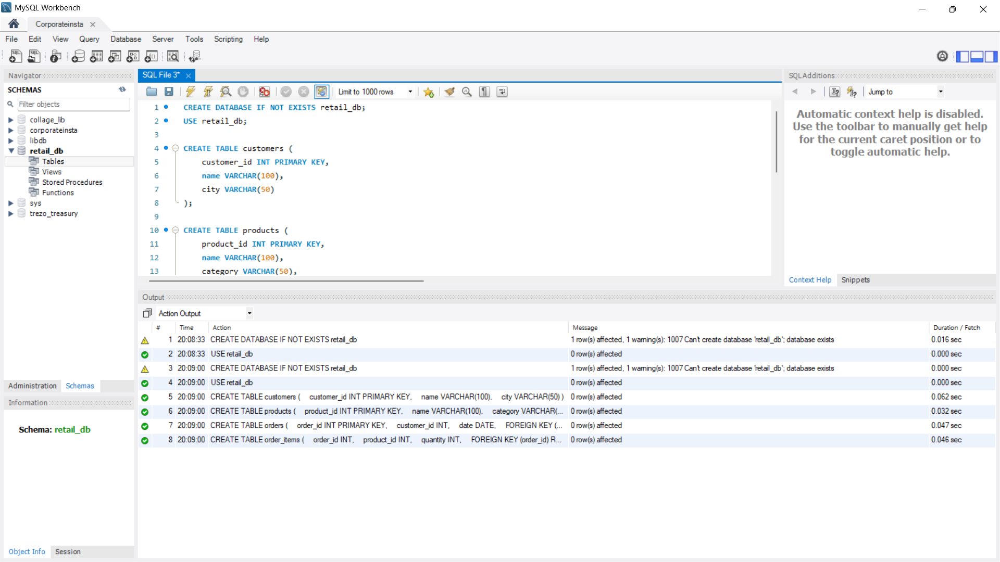

**Insert Customers**
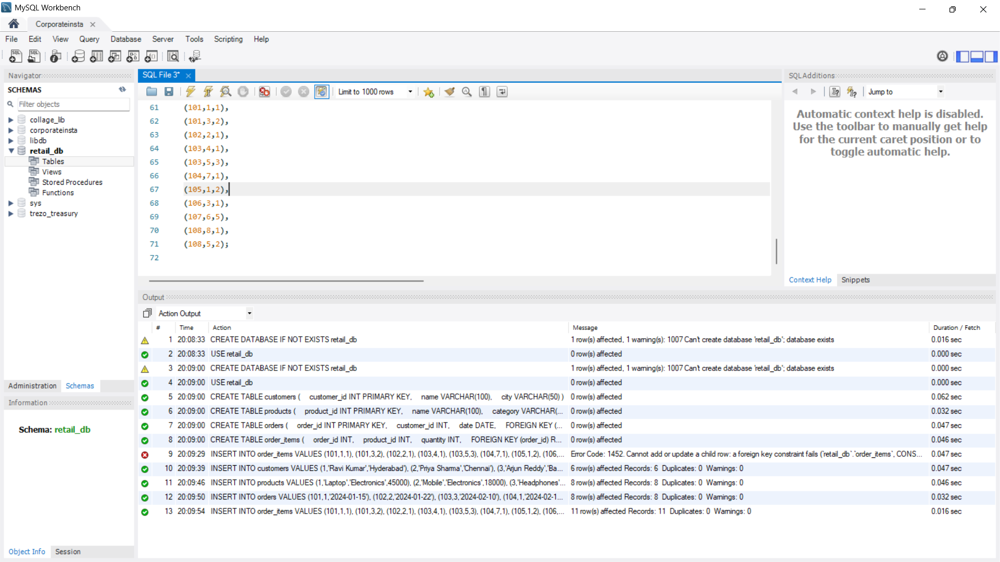

**Insert Products**
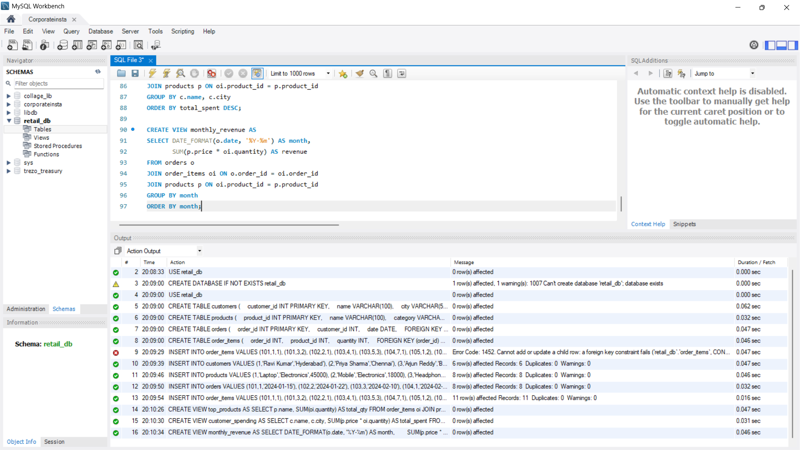

**Insert Orders**
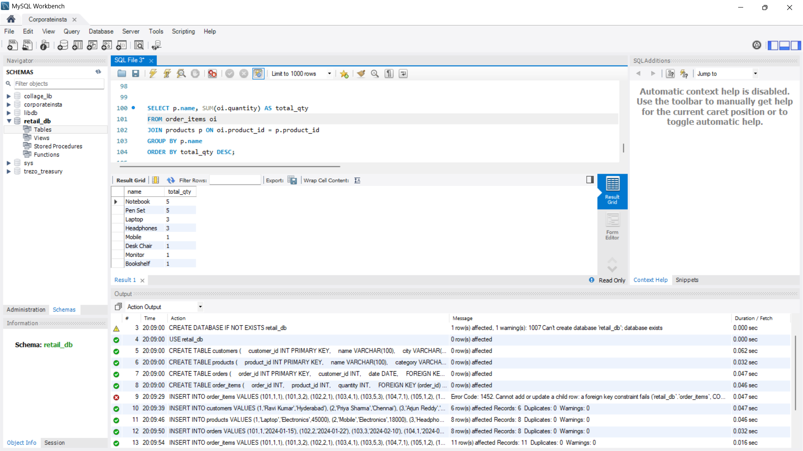

**Insert Order Items**
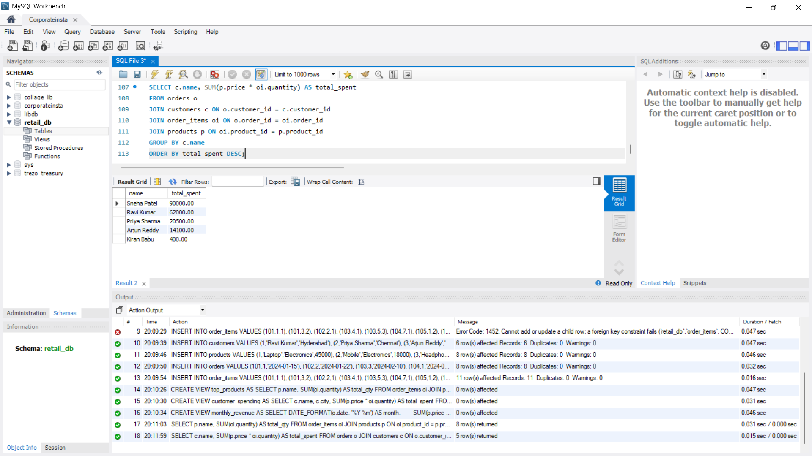

**Create Views**


**Select: Top Products**
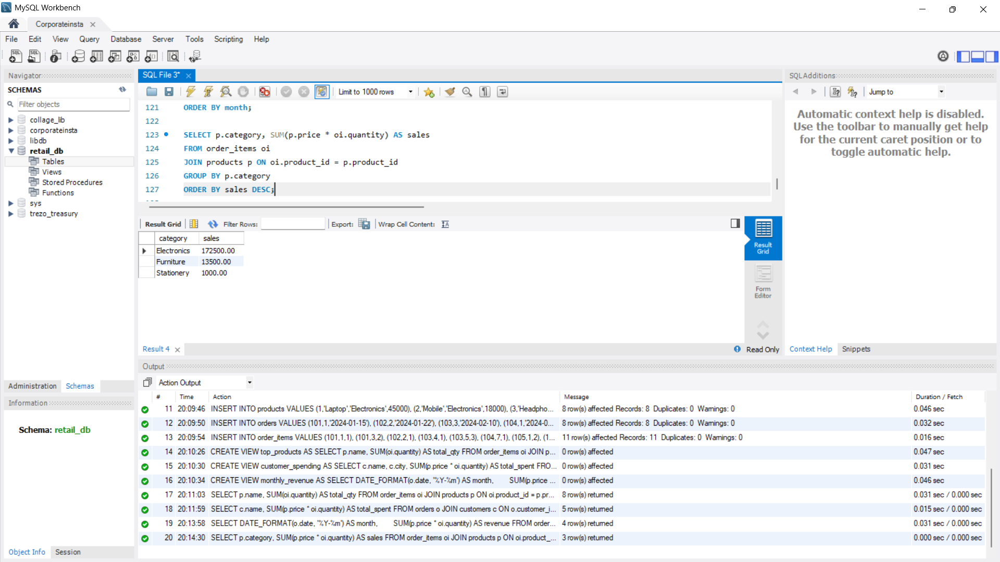

**Select: Customer Spending**
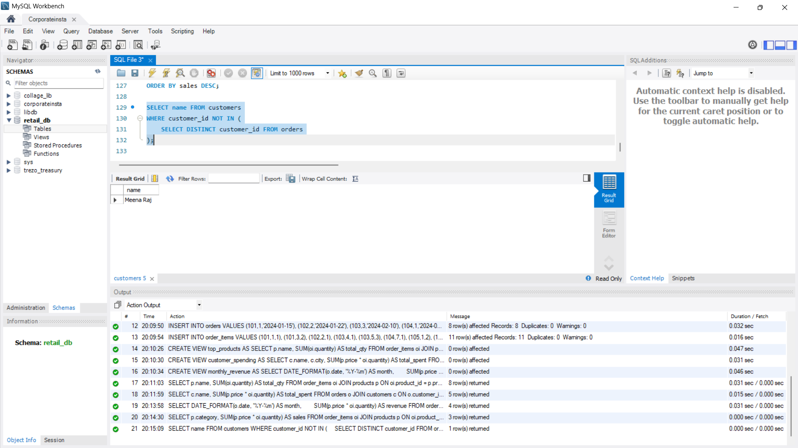

**Select: Monthly Revenue**
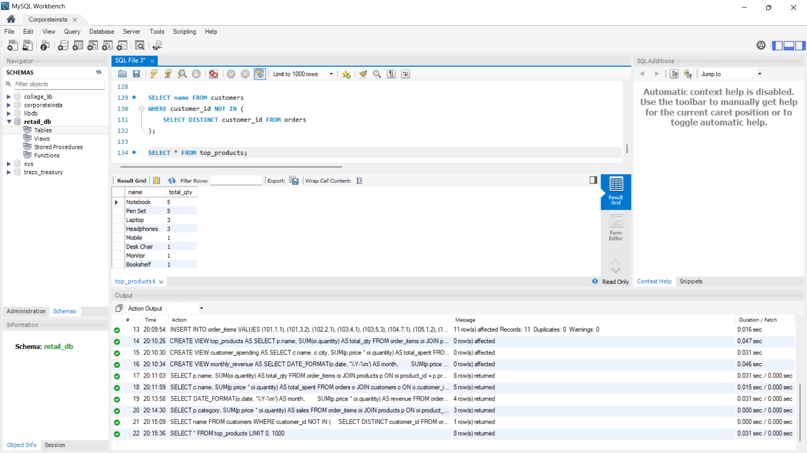

**Select: Category Sales**
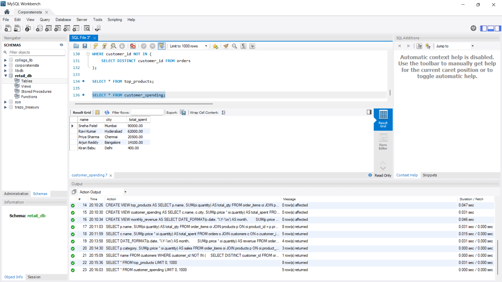

**Select: Customers with No Orders**
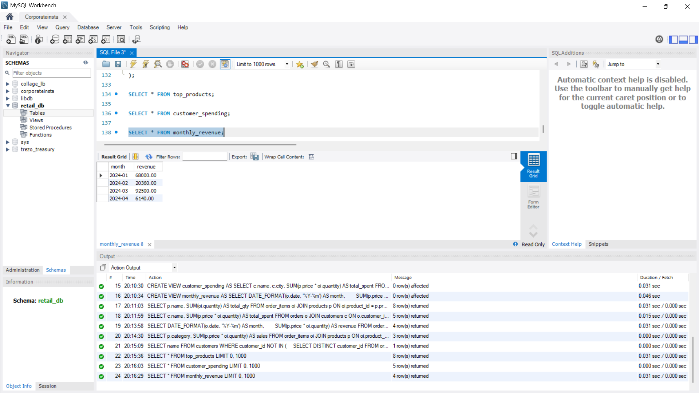
